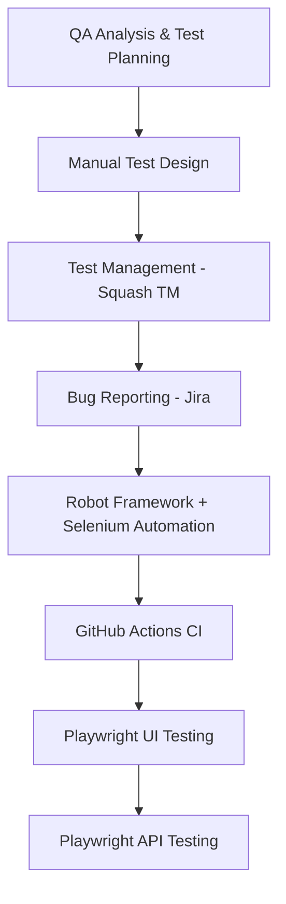

# OpenCart – Web Accessibility QA Portfolio Project
This project documents a structured QA workflow applied to the OpenCart demo e-commerce website, with a focus on keyboard accessibility testing.

The project combines:
- functional analysis
- structured manual testing
- accessibility-oriented validation
- test management workflow
- bug reporting activities
- progressive automation experimentation

The objective is to simulate a realistic QA workflow starting from test analysis and manual testing, then progressively extending toward automation and CI-based execution.

## Project Scope
The project currently focuses on keyboard accessibility validation for selected user flows within the OpenCart demo website.

Covered areas include:
- header navigation
- form interaction
- account registration
- wish list interaction
- shopping cart navigation
- checkout-related flows

Testing is performed using keyboard-only interaction patterns based on WAI keyboard accessibility principles.

## Testing Strategy
The project combines structured and exploratory QA approaches.

Current testing activities include:
- Smoke testing
- Happy Path testing
- Exploratory testing

The main validation focus includes:
- focus visibility
- logical navigation order
- keyboard reachability
- absence of keyboard traps

## Project Structure 
- `docs/` → test plan, project roadmap, and supporting documentation
- `test-design/` → structured manual test cases
- `README.md` → project overview, roadmap, and current status

## Local Test Environment
During the project, the public OpenCart demo website proved to be unreliable for automated testing.

Repeated test executions were occasionally interrupted by Cloudflare protection and temporary service outages, making the execution of automated tests inconsistent.

To provide a stable and repeatable test environment, the project was migrated to a local Docker-based OpenCart instance.

The complete Docker setup is documented in:
- `docs/docker-local-environment.md`

## Project Roadmap

## Current Status
| Area                          | Status            |
|-------------------------------|-------------------|
| Test Plan                     | ✅ Completed      |  
| Smoke Test Cases              | ✅ Completed      |
| Happy Path Test Cases         | ✅ Completed      |
| Exploratory Testing           | ✅ Completed      |
| Squash TM Organization        | ✅ Completed    |
| Jira Bug Reporting            | 🔍 If Relevant Findings Emerge        |
| Robot Framework + Selenium    | 🔄 In Progress        |
| GitHub Actions CI             | ⏳ Planned        |
| Playwright UI Testing         | ⏳ Planned        |
| Playwright API Testing        | ⏳ Planned        |